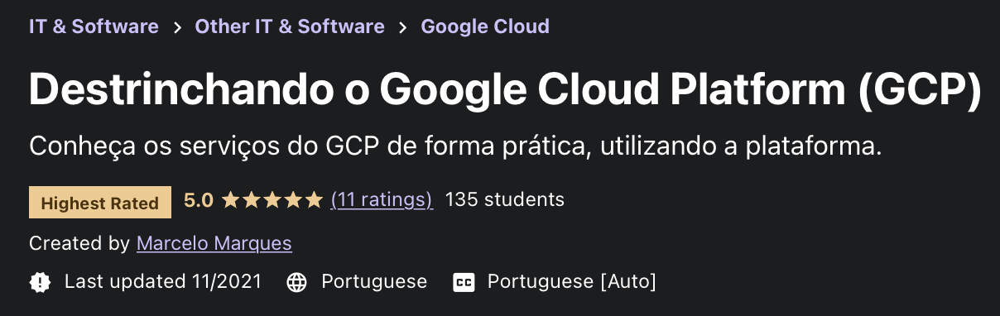

# Destrinchando o GCP (Google Cloud Platform)

## Informações Gerais

Códigos utilizados no treinamento <a href="https://www.udemy.com/course/destrinchando-o-gcp/">Destrinchando o GCP</a>

<a href="https://www.udemy.com/course/destrinchando-o-gcp/">

</a>

## Contatos

Caso encontre algum problema, ou mesmo tenha uma sugestão, fique a vontade para entrar em contato comigo. As informações podem ser encontradas no meu <a href="https://github.com/marcelomarques05">perfil</a> aqui no GitHub
