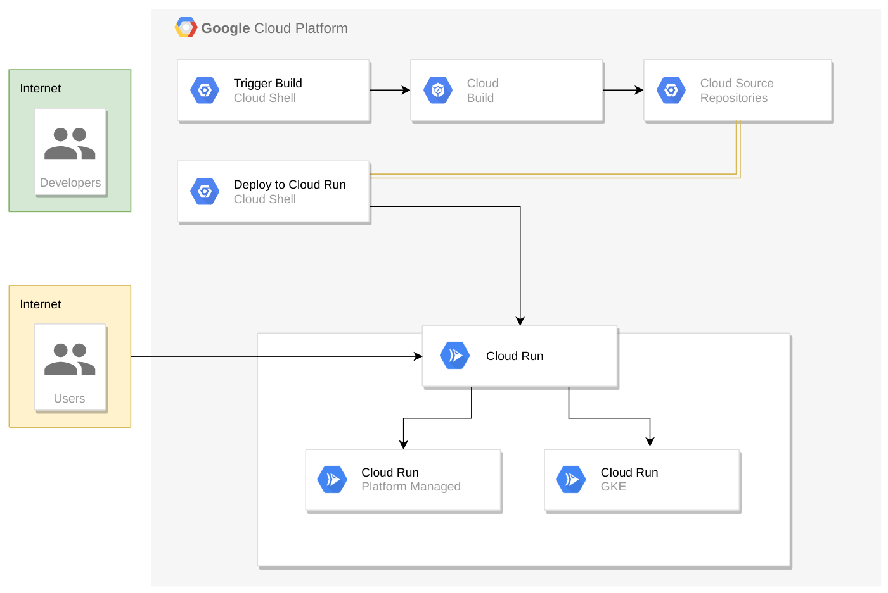
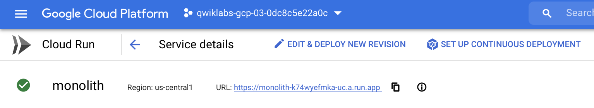
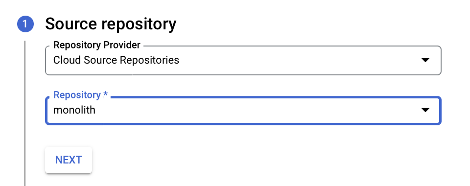
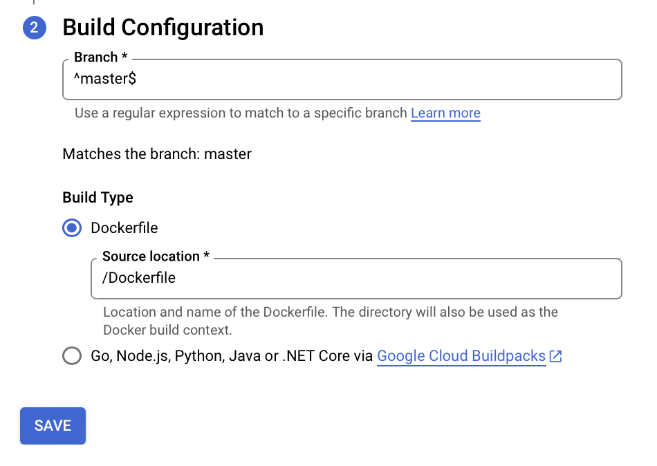
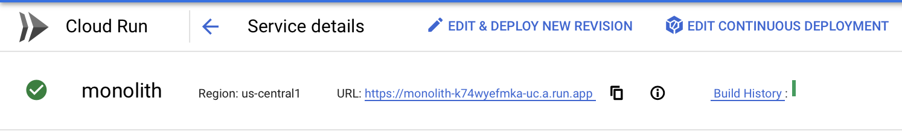

# Destrinchando o GCP

## Labs

### Deploy App With Cloud Run
---
Objetivos:

1. Criar uma imagem de uma aplicação.
2. Fazer o deploy dessa imagem no Cloud Run.
3. Configurar o Continuous Deployment no Cloud Run.
4. Efetuar alteração na aplicação para validar Continuous Deployment.

<p align="center"></p>

---

#### Primeira Parte

1. Habilitar APIs que iremos utilizar

```bash
gcloud services enable cloudbuild.googleapis.com run.googleapis.com
```

2. Configure o nome do seu projeto em uma variável e acesse a pasta da aplicação

```bash
export GOOGLE_CLOUD_PROJECT="Seu Project ID"
cd ./monolith
```

3. Preparar o código

```bash
npm install -g npm

cd ./monolith
npm install

cd ../microservices
npm install

cd ../react-app
npm install
npm run build
```

4. Fazer o Build no GCP e criar o container.

```bash
cd ../monolith
gcloud builds submit --tag gcr.io/${GOOGLE_CLOUD_PROJECT}/monolith:1.0.0 .
```

5. Fazer o deploy da aplicação para o Cloud Run

```bash
gcloud run deploy monolith --image=gcr.io/${GOOGLE_CLOUD_PROJECT}/monolith:1.0.0 --platform managed --region=us-central1 --allow-unauthenticated --max-instances=1
```

#### Segunda Parte

1. Criar o Source Repository

```bash
cd ~
gcloud source repos create --project ${GOOGLE_CLOUD_PROJECT} monolith
```

2. Copiar o código para o CSR

```bash
cd ~
gcloud source repos clone monolith --project=${GOOGLE_CLOUD_PROJECT}
cp -fr ~/destrinchando-o-gcp/labs/deploy-app-with-cloud-run/monolith/* ~/monolith/
```

3. Envie os arquivos

```bash
cd ~/monolith
git add -A
git config --global user.email "you@example.com"
git config --global user.name "Your Name"
git commit -m "First Commit"
git push -u origin master
```

4. Configure o Continuous Deployment no Cloud Run

- Clique em ```Edit Continuous Deployment```

<p align="center"></p>

- Selecione o "Cloud Source Repositories" e marque o repositório ```monolith```

<p align="center"></p>

- Altere a branch para ```^master$``` e selecione a opção para ```Dockerfile```. Clique em Salvar.

<p align="center"></p>

- Um novo deploy vai ser feito para validar o trigger. O status pode ser visto na console em ```Build History```

<p align="center"></p>

#### Terceira Parte

1. Vamos alterar um dos produtos. Iremos alterar do ```Vintage Typerwriter``` para o ```Pense Bem```.

```bash
sed -i 's\"Vintage Typewriter"\"Pense Bem"\' ~/monolith/data/products.json
sed -i 's\"This typewriter looks good in your living room."\"Think Well. :)"\' ~/monolith/data/products.json
sed -i 's\"static/img/products/typewriter.jpg"\"static/img/products/pensebem.jpg"\' ~/monolith/data/products.json
```

2. Envie as alterações para o Source Repositories

```bash
cd ~/monolith
git add -A
git commit -m "Pense Bem"
git push -u origin master
```

3. A trigger deve ser disparada. Ao finalizar, acesse a aplicação e verifique na opção de ```Products``` se o Pense Bem foi inserido no lugar da máquina de escrever.

Pronto! Nesse lab utilizamos o Cloud Run, o Cloud Source Repositories, o Cloud Build para configurar um pequeno pipeline de deploy.

Espero que tenha sido interessante para você.

Grande abraço.